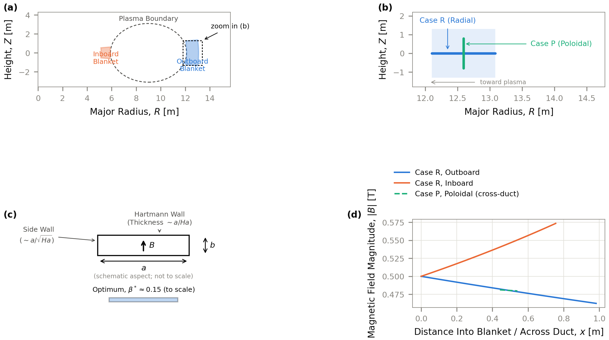
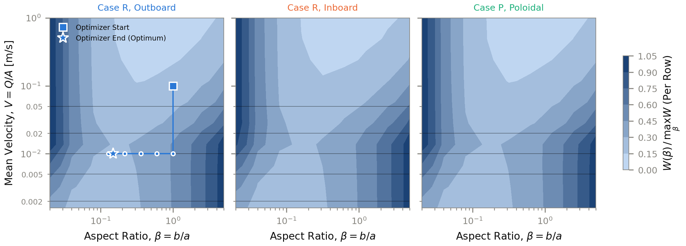
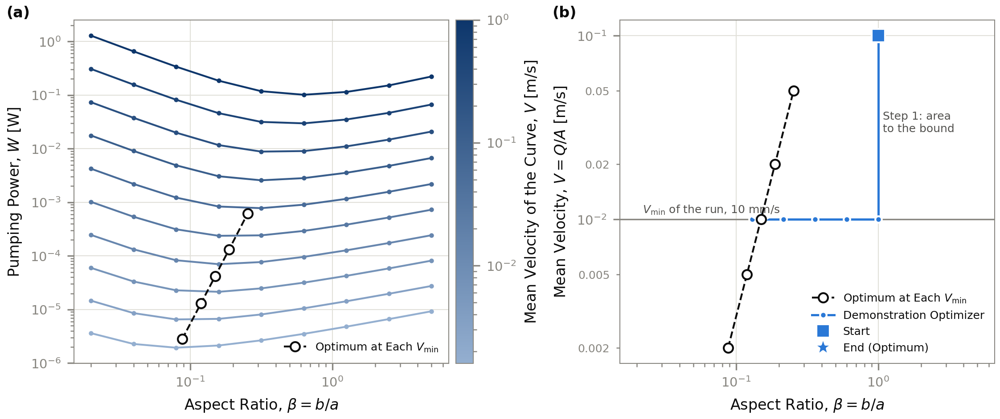
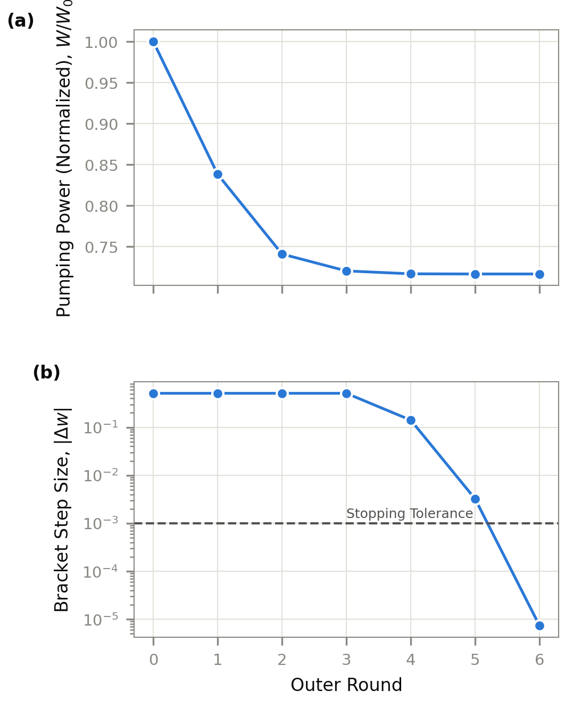
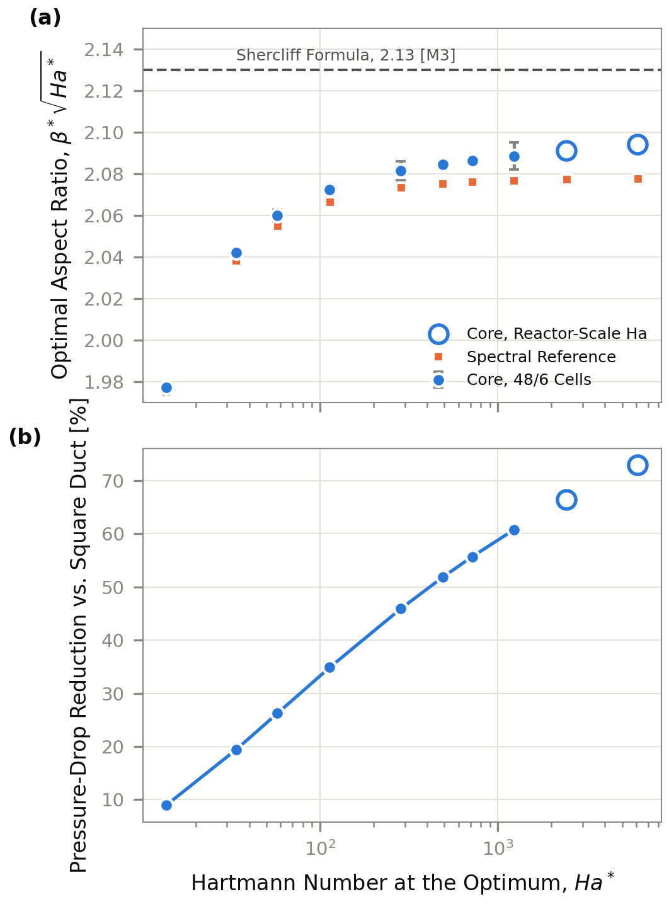
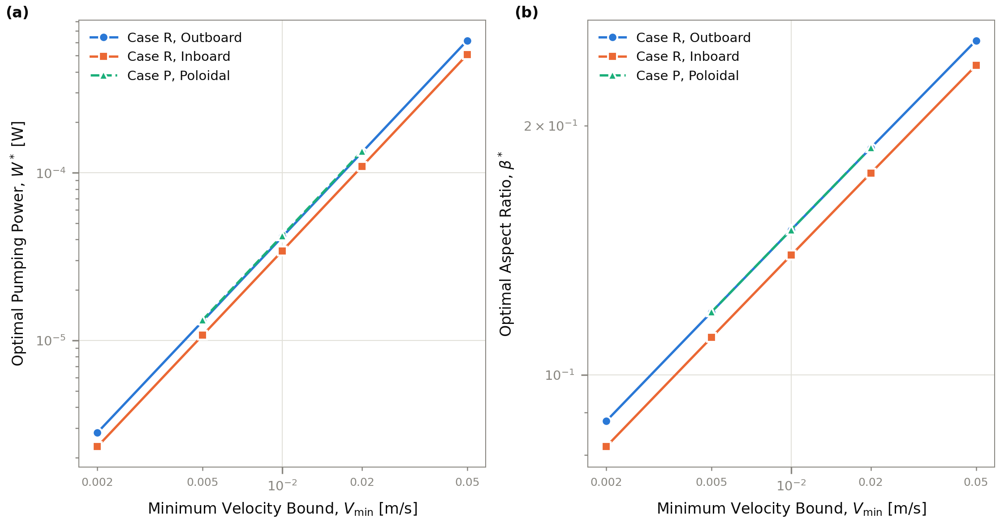
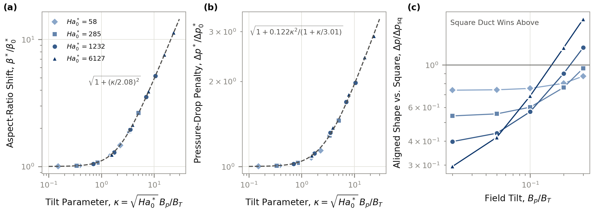
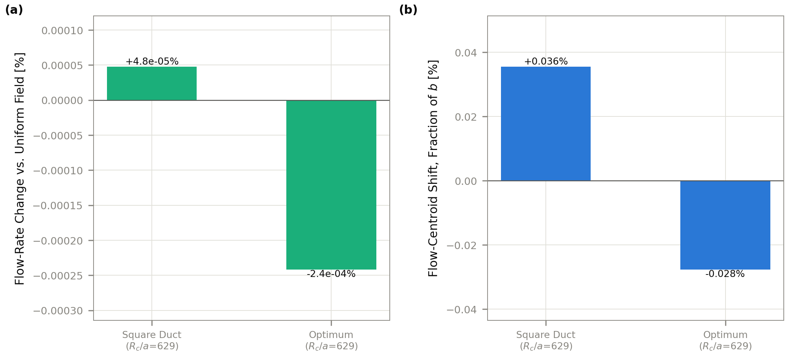
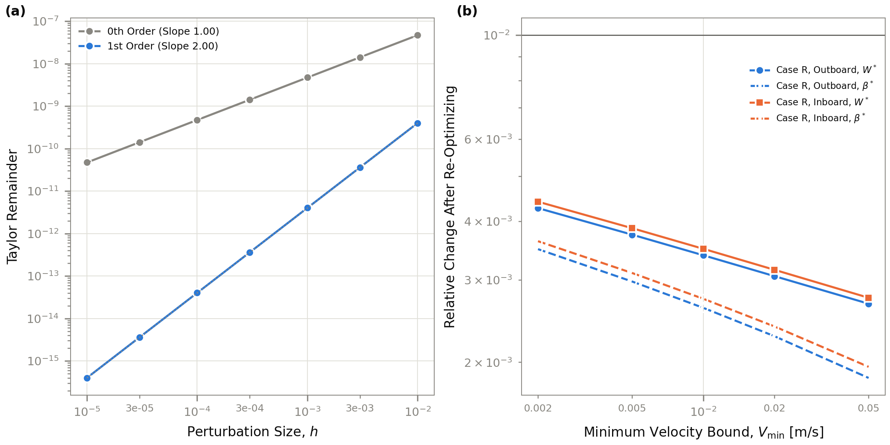
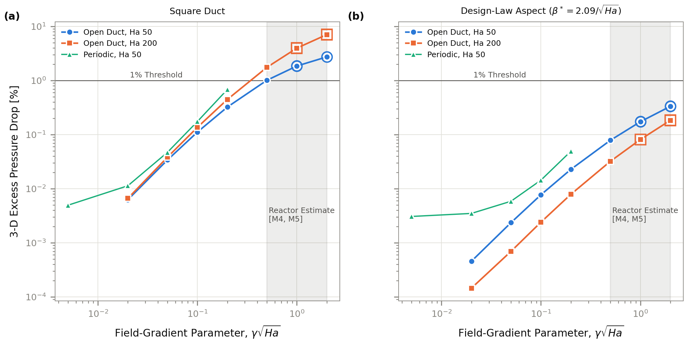

<sub>LMhdX Duct Optimization · Stage 2 (3b.3), Tier 0.5</sub>

# The Duct Design Law

At fixed flow, an insulated PbLi blanket duct in a strong magnetic field has an interior optimum aspect ratio. Nishio et al. computed that optimum in 2025. This study states it as a law, β\*√<i>Ha</i>\* → 2.08 from <i>Ha</i>\* 14 to 6,109, checks it against an independent spectral solver and open-duct 3-D solves, and measures how it moves when the field tilts off the walls.

> [!NOTE]
> **Draft — not yet posted to the 3b.3 issue**

**Date** 2026-10-06 · **Repo** TylerBrandes/LMhdX-Duct-Optimization · **Runs** uwplasma/LMhdX, stage2/port-fix at d665151 · **Package** lmhdx 1.6.0

| Headline | Value | Note |
|:--|:--|:--|
| Beta\*√Ha\* limit | **2.08** | spectral reference; Shercliff gives 2.13 |
| Δp reduction | **9–73%** | vs. the equal-area square |
| Ha\* range | **14–6,109** | 2-D, with a spectral check |
| Tilt for ≤10% penalty | **κ < 1.7** | κ = √Ha\*<sub>0</sub> · B<sub>p</sub>/B<sub>T</sub> |

**Files in this folder**

| Path | What it holds |
|:--|:--|
| `results.json` | Every recorded result and its metadata (inputs, exits, per-stage cost); the figures and tables read only this. |
| `checkpoint.json` | The per-stage record the driver writes as each stage finishes. |
| `figures/` | F1–F10 as vector PDF, 300-dpi PNG, and a CSV of the plotted data. |
| `tables/` | T1–T10 as CSV and LaTeX (booktabs). |
| `captions.md` | Draft captions for every figure and table. |
| `report.html` | This write-up as a standalone page (open it in a browser). |
| `history/` | The checkpoint as it stood before each phase of the study (see below). |

Figure numbers in this write-up follow reading order; the files keep the pipeline's names (F1–F10, T1–T10).

## 01. Problem: Minimum pumping power at fixed flow

A straight PbLi duct with insulated walls sits in a strong, spatially varying tokamak field. The pumping power needed to push a fixed flow rate <i>Q</i> through it depends on the duct's cross-section: its half-width <i>a</i> along the field (the Hartmann walls) and its half-width <i>b</i> across it (the side walls), with aspect ratio <i>β</i> = <i>b</i>/<i>a</i>. The question: for fixed <i>Q</i> and a lower bound on the mean velocity, <i>V</i> ≥ <i>V</i><sub>min</sub> (a proxy for heat removal), what shape minimizes the pressure drop?

Two duct orientations are modeled, both placed in the EU DEMO radial build [<a href="#ref-m1">M1</a>]:

> [!NOTE]
> **Case R — Radial**
>
> A duct running from the first wall into the blanket at the midplane. The toroidal field varies as 1/<i>R</i> along its axis: it falls 8% along the outboard duct (0.982 m) and rises 14% along the inboard one (0.755 m). It is modeled as a sum of independent 2-D cross-section solves at six stations along the axis (“locally fully developed”), each at its own local field.

> [!NOTE]
> **Case P — Poloidal, a correctness check**
>
> A vertical duct at the outboard midplane, upward-flow leg. Its field varies across the duct instead of along it, and LMhdX solves the exact curl-free 1/<i>R</i> field on the cross-section. Case P's optimum matches Case R outboard's to four digits and its pumping power differs only by the duct length, so it serves as a check on the field handling rather than as a separate design. Buoyancy matters in a heated vertical duct and is out of scope: this is a forced-flow hydraulic result only.



<b>Figure 1.</b> (a) Locator: first-wall radii 5.9 / 12.1 m inboard/outboard, blanket depths 0.755 / 0.982 m [<a href="#ref-m1">M1</a>]. (b) Case R and Case P in their true relative orientation. The bars mark orientation, not a solved volume: every optimum here comes from 2-D cross-section solves, and the 3-D solves of Figure 10 check that approximation. (c) Cross-section convention (<i>a</i> along <i>B</i>, <i>b</i> across it); the shaded rectangle is the Case R outboard optimum, to scale. (d) |<i>B</i>| along the two Case R ducts and across the Case P duct, at the lab-scale first-wall field of 0.5 T.

### Formulation

```text
minimize    W(a, b) = Q · Δp(a, b)
variables   u = ln(4ab)  (area),   w = ln(b/a)  (aspect)
subject to  V = Q / e^u ≥ V_min,   β ∈ [β_lo, β_hi]
checked     Re/Ha ≤ 200 and γ√Ha ≤ 0.2 at every station; Re/√Ha and Ha reported
sweep       V_min → Pareto front (W*, V_min), ε-constraint method [O1, O4]
```

In (<i>u</i>, <i>w</i>) the constraints form a box, so projecting onto them is clipping. In practice the problem is one-dimensional: <i>W</i> falls monotonically with area at every sampled aspect, so the velocity bound is always active and the aspect ratio is the only interior variable. Each Pareto point is the design law evaluated at that <i>V</i><sub>min</sub>'s Hartmann number. <i>Q</i> stays fixed, so <i>Ha</i> is not capped.

### Table 1 — Frozen inputs

Recorded before any result was examined. PbLi properties at 573 K from Martelli, Venturini & Utili 2019 [<a href="#ref-d3">D3</a>]; geometry from the EU DEMO radial build [<a href="#ref-m1">M1</a>].

*Table 1. Frozen inputs and properties. The first-wall radii and blanket depths are an estimate from the radial build, not a table value.*

| Quantity | Value | Unit | Source |
|:--|--:|:--|:--|
| PbLi Temperature | 573 | K | Martelli, Venturini & Utili 2019 [D3] |
| Conductivity σ | 8.840×10⁵ | S/m | [D3] |
| Density ρ | 9838 | kg/m³ | [D3] |
| Dynamic Viscosity μ | 2.150×10⁻³ | Pa·s | [D3] |
| Specific Heat c\_p | 189.8 | J/(kg·K) | [D3] |
| First-Wall Field B\_fw | 0.50 | T | Plan 4.4, lab-scale |
| R₀ | 9.0 | m | Federici et al. 2019 [M1] |
| Outboard First Wall | 12.1 | m | [M1] |
| Inboard First Wall | 5.9 | m | [M1] |
| Outboard Blanket Depth | 0.982 | m | [M1] |
| Inboard Blanket Depth | 0.755 | m | [M1] |
| Target Flow Rate Q | 2.40×10⁻⁶ | m³/s | Plan 4.4 (worked example) |
| Default V\_min | 10.0 | mm/s | Plan 2.4 |
| V\_max | 1.0 | m/s | Plan 2.4 |
| Aspect Bounds (Beta) | [0.02, 5.0] | — | No blanket-space box (user decision) |

## 02. Method: A block-coordinate optimizer, verified on three meshes

LMhdX's `channel_flow_response` solves the Stokes-limit MHD duct flow on a staggered mesh for one cross-section. Case R sums the pressure drop over its stations; Case P solves the exact 1/<i>R</i> field in one 2-D solve. Mesh cost depends only on the aspect ratio <i>β</i>: the area enters through a traced `field_scale` argument, so its gradient is exact and needs no new mesh. A new aspect costs 4–8 s to build and compile; a further solve on a warm mesh takes 5–20 ms.

That asymmetry shapes the optimizer. A mesh-free bisection in ln-area <i>u</i> alternates with a five-point quadratic bracket in ln-aspect <i>w</i> over cached meshes. Projected gradient with an Armijo line search was tried first and dropped: every trial aspect is a new mesh, and one optimization took over 900 s. The demonstration run below starts from a square duct at 0.1 m/s; its first step in area moves straight to the velocity bound, and the remaining rounds search in aspect. It converges in seven rounds (37 evaluations, 329 s).

Every optimum is then found again on three meshes at a constant refinement ratio of 1.5 (32/4, 48/6 and 72/9 cells across the section / in the wall layer) and compared with an independent spectral solver.



<b>Figure 2.</b> Pumping-power landscape over aspect ratio and mean velocity. Each row is normalized by its own maximum over aspect, so the colours compare aspects at one velocity only: a lighter row is not a cheaper row, and across rows <i>W</i> rises with <i>V</i> (Figure 3). The demonstration optimizer (Case R outboard) starts from a square duct at √(<i>V</i><sub>min</sub><i>V</i><sub>max</sub>) = 0.1 m/s (square marker). Its first step, in area, goes straight down to <i>V</i><sub>min</sub> = 10 mm/s; the rest is a search in aspect along that bound. That search steps past the optimum once (round 3, Figure 4) and corrects back, which puts one circle just left of the star. The five horizontal lines are the <i>V</i><sub>min</sub> values of Figure 6.



<b>Figure 3.</b> The Case R outboard landscape of Figure 2, two quantities at a time and in absolute pumping power. (a) <i>W</i> against aspect ratio, one curve per sampled mean velocity: at every aspect <i>W</i> rises with <i>V</i>, and each curve has its own interior minimum (the landscape samples 9 aspects, so minima between samples are not resolved). Open circles: the optimum at each <i>V</i><sub>min</sub> of the Pareto sweep. (b) The same optima in aspect ratio and velocity, with the demonstration optimizer: one step in area from 0.1 m/s down to the bound, then the search in aspect.



<b>Figure 4.</b> Convergence of the demonstration run (Case R outboard, <i>V</i><sub>min</sub> = 10 mm/s). The bracket step in aspect ratio clears the 10⁻³ stopping tolerance in round 6.

### Why these choices

> [!NOTE]
> **Why the velocity always sits on V\_min**
>
> At fixed <i>Q</i>, a higher mean velocity means a smaller duct (<i>V</i> = <i>Q</i>/<i>A</i>), and a smaller duct needs more pressure per metre. In this laminar, insulated regime Δ<i>p</i>/<i>L</i> ∝ <i>V B</i>√(<i>σμ</i>)/<i>a</i>, so the higher <i>V</i> and the smaller <i>a</i> both raise it, and the pumping power <i>W</i> = <i>Q</i>Δ<i>p</i> rises with <i>V</i>. Along the optimum, where <i>a</i>\* ∝ <i>A</i><sup>2/3</sup>, this gives <i>W</i> ∝ <i>V</i><sup>5/3</sup>; the Pareto points give a measured slope of 1.67. Across the Case R outboard landscape, the best sampled aspect costs 1.9×10⁻⁶ W at 1.6 mm/s and 0.10 W at 1 m/s (Figure 3a).
>
> The familiar rule that lower resistance gives higher velocity is about a fixed duct driven by a fixed pressure: lowering the friction raises the flow. Here the flow rate is fixed and the geometry is free, so the cheapest duct is the largest one allowed. Even in a fixed duct, raising <i>V</i> costs power: Δ<i>p</i> ∝ <i>V</i> in this regime, so <i>W</i> ∝ <i>V</i><sup>2</sup>. That is why the problem needs the bound <i>V</i> ≥ <i>V</i><sub>min</sub>, a stand-in for heat removal, and why every optimum lands on it. Higher velocity does help heat transfer, but this hydraulic model sees that benefit only through the bound.

> [!NOTE]
> **A sum of 2-D slices, not a 3-D solve**
>
> Case R's field changes only along the duct axis, not across the cross-section at a station. When that change is slow, each station behaves like a piece of an infinite straight duct in a locally uniform field, and the total pressure drop is the sum of the stations' 2-D solves [<a href="#ref-m4">M4</a>, <a href="#ref-m5">M5</a>]. “Slow” means <i>γ</i>√<i>Ha</i> ≪ 1, with <i>γ</i> = <i>a</i>|d<i>B</i>/d<i>x</i>|/<i>B</i>, the field's relative change per half-width (<i>a</i>/<i>R</i> for a 1/<i>R</i> field).
>
> <i>γ</i> is easy to confuse with <i>β</i>, but they describe different things. <i>β</i> is the duct's own cross-section shape, the quantity being optimized. <i>γ</i> describes how fast the external field changes along the duct, and only decides whether the station sum can be trusted (Figure 10); it plays no part in the optimization.
>
> A genuine 3-D solve is possible: LMhdX's 3-D core has an inlet and an outlet, and Figure 10 uses it to check the station sum. It is not used inside the optimization because each open-duct solve behind Table 7 took 12–41 s, against milliseconds for a warm 2-D solve used hundreds of times per sweep. Case P needs no station sum: its field varies within the cross-section, so one 2-D solve captures it.

> [!NOTE]
> **Scaled meshes for the aspect derivative**
>
> A finite difference in <i>w</i> compares <i>W</i> at neighbouring aspects. Building each neighbour as a newly clustered mesh puts a discretization jump between them. For the verification runs, the neighbours are made by scaling the centre mesh's <i>z</i> faces instead, so the discrete <i>W</i> is a smooth function of <i>β</i> (a quartic fit through five points has a residual of 8×10⁻¹²), and <i>β</i>\* comes from that quartic.

> [!NOTE]
> **An independent reference**
>
> The reference is a spectral (Chebyshev collocation) solve of the same fully developed problem in `validation/shercliff.py`, extended with an aspect-ratio keyword. It shares no discretization with the staggered core, so agreement between them is not a shared error.

> [!NOTE]
> **(u, w) coordinates and a Pareto sweep**
>
> Working in <i>u</i> = ln(area) and <i>w</i> = ln(aspect) turns the constraints into clipping and matches where the cost lives: only <i>w</i> changes the mesh. <i>V</i><sub>min</sub> stands in for heat removal, which trades off against pumping power; fixing it and minimizing <i>W</i> (the ε-constraint method [<a href="#ref-o1">O1</a>, <a href="#ref-o4">O4</a>]) traces that trade-off out (Figure 6) instead of hiding it in an arbitrary weighted sum.

## 03. Results: The design law holds from <i>Ha</i>\* 14 to 6,109

At fixed area, sweeping the Hartmann number of the starting square duct, <i>Ha</i><sub>sq</sub>, from 10 to 1,000 and finding the optimal aspect ratio at each gives the design law. On the spectral reference, <i>β</i>\*√<i>Ha</i>\* rises from 1.975 at <i>Ha</i>\* 14 to 2.078 at 6,109 and flattens toward about 2.08. The core on 48/6 cells sits 0.1–0.8% above the reference, the gap growing with <i>Ha</i>\*.

Shercliff's asymptotic friction formula (Shercliff 1953 [<a href="#ref-sh53">Sh53</a>]), in the form given by Smolentsev [<a href="#ref-m3">M3</a>] with α = 0.852, gives <i>β</i>\*√<i>Ha</i>\* = 2.5α = 2.13, 2.5% above the reference's limit, although the formula is stated valid only for <i>β</i>√<i>Ha</i> ≫ 18. Müller & Bühler print α = 0.825 for the same formula [<a href="#ref-m14">M14</a>], which would give 2.06; which printed value is right is not re-derived here. The optimum's advantage grows with the field: 9% below the equal-area square at <i>Ha</i>\* 14, 61% at 1,229 and 73% at 6,109.



<b>Figure 5.</b> (a) <i>β</i>\*√<i>Ha</i>\* at fixed area against the Hartmann number at the optimum. Filled circles: the core on 48/6 cells, with the three-mesh GCI at the observed order [<a href="#ref-o15">O15</a>] at <i>Ha</i>\* 58, 285 and 1,229. Squares: the spectral reference. Hollow circles: <i>Ha</i>\* ≈ 2,400 and 6,100, toward reactor Hartmann numbers (48/6 cells). Dashed: Shercliff's formula as given in [<a href="#ref-m3">M3</a>]. (b) The pumping-power reduction over a square duct of equal area.

### Table 2 — The design law

*Table 2. The design law at fixed area: the core on 48/6 cells and the spectral reference. Ha\_sq is the Hartmann number of the starting square duct; Ha\* is at the optimum. GCI at the observed order where three meshes were run.*

| Ha\_sq | Ha\* | Beta\* (48/6) | s\* (48/6) | Beta\* (Ref.) | s\* (Ref.) | Reduction (%) | Beta\* GCI (%) |
|:--|--:|--:|--:|--:|--:|--:|--:|
| 10 | 13.7 | 0.53470 | 1.9773 | 0.53390 | 1.9751 | 9.0 | — |
| 20 | 33.7 | 0.35164 | 2.0421 | 0.35074 | 2.0382 | 19.4 | — |
| 30 | 57.6 | 0.27147 | 2.0599 | 0.27061 | 2.0550 | 26.2 | 0.18 |
| 50 | 113.3 | 0.19470 | 2.0726 | 0.19392 | 2.0664 | 34.9 | — |
| 100 | 284.7 | 0.12336 | 2.0815 | 0.12271 | 2.0733 | 45.9 | 0.29 |
| 150 | 488.4 | 0.09433 | 2.0847 | 0.09376 | 2.0752 | 51.8 | — |
| 200 | 716.3 | 0.07796 | 2.0865 | 0.07744 | 2.0760 | 55.7 | — |
| 300 | 1,229.1 | 0.05958 | 2.0887 | 0.05913 | 2.0768 | 60.8 | 0.42 |
| 500 | 2,426.8 | 0.04245 | 2.0912 | 0.04207 | 2.0773 | 66.4 | — |
| 1000 | 6,108.8 | 0.02680 | 2.0944 | 0.02651 | 2.0776 | 72.9 | — |

### Why the gain grows with the field

What stays constant is <i>β</i>\*√<i>Ha</i>\*, not <i>β</i>\*. Two things set the friction of an insulated duct. The core is braked by the Lorentz force, with its current closing through the thin Hartmann layers: that part of Δ<i>p</i>/<i>L</i> scales as <i>μV Ha</i>/<i>a</i>² = <i>V B</i>√(<i>σμ</i>)/<i>a</i> and falls as the duct is lengthened along the field. The side layers, of thickness about <i>a</i>/√<i>Ha</i>, carry a velocity deficit that removes a fraction α/(<i>β</i>√<i>Ha</i>) of the flow and grows as the duct is narrowed. Shercliff's formula combines the two:

```text
Δp/L = μ V Ha / [ a² (1 − α/(β√Ha) − 1/Ha) ]        α = 0.852
```

At fixed area, <i>a</i> grows as 1/√<i>β</i>, so the core term falls as √<i>β</i> while the side-layer term grows. The balance sits where the side layers remove 2/5 of the flow (α/<i>s</i>\* = 2/5, so <i>s</i>\* = 2.5α): each side layer is then about half the half-width <i>b</i>. A higher <i>Ha</i> makes the side layers thinner relative to <i>a</i>, so the duct can be made more slender before they bite, and <i>β</i>\* falls as <i>Ha</i><sub>sq</sub><sup>−2/3</sup> at fixed area (0.53 to 0.027 in Table 2). The square duct cannot adapt, and its core friction rises with <i>Ha</i>. Their ratio follows from the formula:

```text
Δp*/Δp_sq ≈ 2.76 Ha_sq^(−1/3) (1 − 0.852/√Ha_sq)
```

So each factor of 10 in <i>Ha</i><sub>sq</sub> roughly halves the optimum's pressure drop relative to the square, and the reduction keeps growing toward 100%. Optimizing Shercliff's formula exactly gives reductions of 25.8, 45.9, 60.9 and 73.2% at <i>Ha</i><sub>sq</sub> 30, 100, 300 and 1,000, against the measured 26.2, 45.9, 60.8 and 72.9%. At <i>Ha</i><sub>sq</sub> 10, below the formula's range, it gives 7.4% against the measured 9.0%.

> [!NOTE]
> **Prior art**
>
> The fixed-area optimum itself is not new. Nishio et al. 2025 [<a href="#ref-d10">D10</a>] computed the same interior minimum (fixed area and flow, insulating walls, Shercliff's analytic series, 10 T), and their numbers imply <i>b</i>√<i>Ha</i>/<i>a</i> ≈ 2.08; they state no scaling law and no closed form. Müller & Bühler's friction formula (their Eq. 4.49) [<a href="#ref-m14">M14</a>] gives the fixed-area optimum in one line. Topology optimization of MHD duct cross-sections [<a href="#ref-d11">D11</a>] uses conducting walls and has no aspect-ratio study, so it does not compete with the rectangle.
>
> What this study adds is the explicit law with its closed form 2.5α; its finite-<i>Ha</i> correction (1.975 at <i>Ha</i>\* 14); the table out to <i>Ha</i>\* 6,109 checked against an independent solver; the 3-D validity limits (Figure 10); the tilt-aware law (Figure 7); and a differentiable pipeline that finds the optimum rather than tabulating it. The prior-art readings above come from one pass through the papers and are not yet re-derived here.

The closed form of the plan (§4.3) gives <i>a</i>\* = 19.8 mm at the default <i>V</i><sub>min</sub> = 10 mm/s; the optimizer finds 20.0 mm. Across all ten Case R optima, <i>a</i>\* lies 1.0–1.7% above the closed form (the registered limit is 5%), and <i>β</i>\*√<i>Ha</i>\* averaged over the stations lies within 0.7% of the registered target 2.09.

### Pareto fronts

At fixed <i>Q</i>, <i>V</i><sub>min</sub> from 2 to 50 mm/s traces a Pareto front for Case R outboard and inboard; Case P is run at 5–20 mm/s as a check. <i>V</i> = <i>V</i><sub>min</sub> is active with a positive multiplier at all ten Case R points. From 2 to 50 mm/s the outboard optimum shrinks from <i>a</i>\* = 58.4 mm to 6.9 mm and <i>β</i>\* rises from 0.088 to 0.254; the Hartmann number reaches 695 (inboard, 2 mm/s).

Case R inboard needs 17–18% less pumping power than outboard at every <i>V</i><sub>min</sub>. Most of that is length: the inboard duct is 23% shorter. Its stronger field raises the pressure drop per metre by about 7%, which takes back part of the saving. Case P sits 1.8% above Case R outboard at every point, which is the length ratio 1.0/0.982 m, and its <i>β</i>\* matches to four digits.



<b>Figure 6.</b> Optimal pumping power (a) and aspect ratio (b) against <i>V</i><sub>min</sub>. The Hartmann number reaches 695 at fixed <i>Q</i>. One of the 13 points, Case R inboard at 2 mm/s, fails <i>γ</i>√<i>Ha</i> ≤ 0.2 at its stations (Table 6).

### Table 3 — Optima at the default <i>V</i><sub>min</sub> = 10 mm/s

*Table 3. Optima from the block-coordinate optimizer on the 48/6 working mesh. Table 5 re-optimizes each on three meshes and gives its stationarity.*

| Case | a\* (mm) | b\* (mm) | Beta\* | W\* (W) | Active Bound | Multiplier |
|:--|--:|--:|--:|--:|:--|--:|
| R Outboard | 20.02 | 3.00 | 0.1497 | 4.1495×10⁻⁵ | V\_min | 6.93×10⁻⁵ |
| R Inboard | 20.74 | 2.89 | 0.1395 | 3.4226×10⁻⁵ | V\_min | 5.72×10⁻⁵ |
| P | 20.02 | 3.00 | 0.1497 | 4.2242×10⁻⁵ | V\_min | 7.06×10⁻⁵ |

### When the field tilts off the walls

The poloidal field, estimated at 10–20% of the toroidal field (an unverified estimate), tilts <i>B</i> within a radial duct's cross-section. The slender optimum is sensitive to that tilt and the square duct is not. At <i>B</i><sub>p</sub>/<i>B</i><sub>T</sub> = 0.1 (5.7°) the aligned optimum's pumping power rises 8.0% outboard and 9.3% inboard; at 0.2 (11.3°), 29.5% and 34.1%. The equal-area square rises 0.1–0.5%.

Re-optimizing in the tilted field gives a tilt-aware law. Across aligned optima <i>Ha</i>\*<sub>0</sub> = 58–6,127 and tilts up to <i>B</i><sub>p</sub>/<i>B</i><sub>T</sub> = 0.3 (16.7°), the optimal shape and its penalty both collapse on <i>κ</i> = √<i>Ha</i>\*<sub>0</sub> · <i>B</i><sub>p</sub>/<i>B</i><sub>T</sub> to within 5%:

```text
β*² = β₀*² + (B_p/B_T)²                    max error 1.5%, rms 0.7%
(Δp*/Δp₀*)² = 1 + 0.122 κ² / (1 + κ/3.01)    max error 2.4%
```

Both are fitted to the same 20 tilted points, so the errors are in-sample. The first says that, at large tilt, the optimum's half-width across the field approaches the sideways drift of a field line over the half-width along it (<i>b</i>\* → <i>a</i> <i>B</i><sub>p</sub>/<i>B</i><sub>T</sub>). For design:

- A penalty of at most 10% needs <i>κ</i> < 1.7: <i>B</i><sub>p</sub>/<i>B</i><sub>T</sub> below 0.10 (5.7°) at <i>Ha</i>\*<sub>0</sub> 285, 0.048 (2.8°) at 1,232 and 0.022 (1.3°) at 6,127.
- Retuning matters above <i>κ</i> ≈ 2. Against keeping the aligned shape, it recovers 10% at <i>κ</i> = 3.4, 28% at 7.0 and 57% at 23.5.
- A duct kept at its aligned shape does worse than the equal-area square beyond a crossing that moves with <i>Ha</i>: <i>κ</i> ≈ 8.1 (<i>B</i><sub>p</sub>/<i>B</i><sub>T</sub> ≈ 0.23) at <i>Ha</i>\*<sub>0</sub> 1,232 and <i>κ</i> ≈ 12.3 (≈ 0.16, 9°) at 6,127; at 285 it extrapolates to <i>κ</i> ≈ 5.4.
- Retuned, the slender duct still beats the square at every point computed: by at least 15.9% (<i>Ha</i>\*<sub>0</sub> 58 at 0.3) and 25.7% at <i>Ha</i>\*<sub>0</sub> 6,127.



<b>Figure 7.</b> The fixed-area optimum in a field tilted by <i>B</i><sub>p</sub>/<i>B</i><sub>T</sub> within the cross-section (insulating walls, finest mesh, 72/9 cells). (a) The optimal aspect ratio relative to the aligned one and (b) the retuned optimum's penalty, both against <i>κ</i>, across four <i>Ha</i>\*<sub>0</sub>; dashed, the two fitted laws above. (c) The aligned optimum's shape kept in a tilted field, against the equal-area square: above 1, the square wins.

### Table 4 — The tilt-aware law

*Table 4. The tilt-aware law on 72/9 cells: the retuned optimum in a tilted field, its penalty, its reduction over the equal-area square in the same field, and the aligned optimum's shape against the square (above 1, the square wins).*

| Ha\*₀ | B\_p/B\_T | κ | Beta\* | Beta\*/Beta\*₀ | Δp\*/Δp\*₀ | Reduction vs. Square (%) | Aligned Shape / Square |
|:--|--:|--:|--:|--:|--:|--:|--:|
| 58 | 0.02 | 0.15 | 0.27163 | 1.002 | 1.001 | 26.2 | 0.738 |
| 58 | 0.05 | 0.38 | 0.27499 | 1.015 | 1.006 | 25.9 | 0.741 |
| 58 | 0.1 | 0.76 | 0.28687 | 1.059 | 1.022 | 24.7 | 0.754 |
| 58 | 0.2 | 1.52 | 0.33211 | 1.226 | 1.075 | 20.7 | 0.801 |
| 58 | 0.3 | 2.28 | 0.39828 | 1.470 | 1.139 | 15.9 | 0.873 |
| 285 | 0.02 | 0.34 | 0.12442 | 1.012 | 1.005 | 45.9 | 0.541 |
| 285 | 0.05 | 0.84 | 0.13180 | 1.072 | 1.029 | 44.6 | 0.555 |
| 285 | 0.1 | 1.69 | 0.15663 | 1.273 | 1.102 | 40.8 | 0.601 |
| 285 | 0.2 | 3.37 | 0.23372 | 1.900 | 1.286 | 31.2 | 0.762 |
| 285 | 0.3 | 5.06 | 0.32426 | 2.636 | 1.453 | 22.5 | 0.960 |
| 1,232 | 0.02 | 0.70 | 0.06227 | 1.050 | 1.021 | 60.2 | 0.398 |
| 1,232 | 0.05 | 1.75 | 0.07672 | 1.293 | 1.112 | 56.8 | 0.440 |
| 1,232 | 0.1 | 3.51 | 0.11596 | 1.955 | 1.317 | 49.0 | 0.569 |
| 1,232 | 0.2 | 7.01 | 0.20933 | 3.528 | 1.691 | 35.2 | 0.902 |
| 1,232 | 0.3 | 10.52 | 0.30673 | 5.170 | 1.979 | 24.8 | 1.230 |
| 6,127 | 0.02 | 1.56 | 0.03296 | 1.237 | 1.093 | 70.8 | 0.295 |
| 6,127 | 0.05 | 3.91 | 0.05662 | 2.126 | 1.370 | 63.5 | 0.418 |
| 6,127 | 0.1 | 7.82 | 0.10386 | 3.899 | 1.797 | 52.5 | 0.688 |
| 6,127 | 0.2 | 15.63 | 0.20204 | 7.585 | 2.435 | 36.7 | 1.229 |
| 6,127 | 0.3 | 23.45 | 0.30119 | 11.307 | 2.892 | 25.7 | 1.734 |

### Case P: a correctness check

At <i>R</i><sub>c</sub>/<i>a</i> = 629, the exact 1/<i>R</i> field changes the flow by +4.8×10⁻⁷ for the square duct and −2.4×10⁻⁶ for the optimum, of order (<i>a</i>/<i>R</i><sub>c</sub>)² = 2.5×10⁻⁶ as expected. It shifts the flow centroid by +0.036% of <i>b</i> for the square, toward the weak-field side, the expected direction, and by −0.028% for the optimum, toward the strong-field side.



<b>Figure 8.</b> Case P's exact curl-free 1/<i>R</i> field [<a href="#ref-m7">M7</a>] against the uniform field, for the equal-area square and the optimum. (a) The flow-rate change. (b) The flow-centroid shift across the duct, weighted by cell area, positive toward the weak-field (outboard) side. Both are negligible for Δ<i>p</i> at this radius ratio.

> [!NOTE]
> **An open question, not a result relied on**
>
> The optimum's centroid shift is mesh-converged (−2.87 to −2.72×10⁻⁴ <i>b</i> from 32/4 to 96/12 cells) and unexplained: an exploratory rule of thumb for this case, 0.1 × (d<i>B</i>/<i>B</i> across the duct), predicts +5×10⁻⁵ there. Nothing downstream depends on it, because its effect on Δ<i>p</i> is of order (<i>a</i>/<i>R</i>)², but its sign should be understood before anything that does depend on it is built.

## 04. Verification: Mesh-converged and within 1% of an independent solver

The area gradient is exact (JAX autodiff through the traced `field_scale`). A Taylor remainder test [<a href="#ref-o10">O10</a>] confirms it at all 13 Pareto points: the zeroth-order remainder falls as <i>O</i>(<i>h</i>) and the gradient-corrected one as <i>O</i>(<i>h</i>²), with slopes of 1.00 and 2.00.

Re-optimized on 32/4, 48/6 and 72/9 cells (Table 5), every point converges at the observed order 2.00–2.01 for <i>β</i>\* and 1.93–1.97 for <i>W</i>\*, with a GCI on <i>β</i>\* of 0.19–0.36%. From 48/6 to 72/9, <i>β</i>\* moves at most 0.37% and <i>W</i>\* at most 0.44%, inside the registered limits of 3% and 1%. A separate check at each 48/6 optimum on 96/9 cells moves <i>W</i> by 0.34–0.59%.

Against the spectral reference, the core's <i>W</i> at its own <i>β</i>\* is 0.48–0.79% low at all 11 verified points (limit 1%), worst at 2 mm/s; the reference's own <i>β</i>\* lies 0.15–0.3% below the 72/9 core's, consistent with the Richardson limit. For the design law, the reference is converged to 10⁻⁸ between 48 and 80 collocation points up to <i>Ha</i>\* 1,229, and between 64 and 80 points to 5×10⁻⁷ and 8×10⁻⁵ at 2,427 and 6,109.

The tilt-aware law meets its own registered exits: from 48/6 to 72/9 cells <i>β</i>\* moves at most 0.66% and Δ<i>p</i>\* 0.68%; a dense spectral solve with both field components agrees with the core within 0.54% on 48/6 cells (<i>Ha</i> 30–100, five cases); and the collapse holds within 5% against a 10% limit.



<b>Figure 9.</b> (a) Taylor test at Case R outboard's default optimum. (b) The change of <i>W</i>\* (solid) and <i>β</i>\* (dashed) when each Case R Pareto point is re-optimized from 48/6 to 72/9 cells; the limits are 1% and 3%.

> [!WARNING]
> **Two exits met only in part**
>
> <b>Stationarity.</b> At the registered steps <i>h</i> = 0.01 and 2<i>h</i>, |d<i>W</i>/d<i>w</i>|/<i>W</i> reads 8.5×10⁻⁶ and 3.4×10⁻⁵ at every point, against a target of 10⁻⁶. The factor of four between them is the <i>h</i>² truncation of the central difference, not noise: the Richardson estimate (6.3–7.0×10⁻⁸) and the <i>h</i>/10 reading (1.0–1.5×10⁻⁷) both meet the target. Reported both ways.
>
> <b>Design law per station.</b> Station by station, <i>β</i>\*√<i>Ha</i>\* deviates from 2.09 by 3.2–3.3% at the inboard 2, 5 and 50 mm/s points, just over the 3% limit, where the field changes 14% along the run. Outboard it deviates by at most 2.3%.

### Table 5 — Every Pareto optimum on three meshes

*Table 5. Every Pareto optimum re-optimized on three meshes of ratio 1.5, the observed order and GCI of Beta\*, the change of W\* from 48/6 to 72/9, the core against the spectral reference at the core's own Beta\*, and the stationarity dW/dw / W at the registered step h and Richardson-extrapolated.*

| Case | V\_min (mm/s) | Beta\* 32/4 | Beta\* 48/6 | Beta\* 72/9 | Beta\* Ref. | Order | GCI (%) | W\* Change (%) | Core vs. Ref. W (%) | dW/dw / W at h | dW/dw / W, Richardson |
|:--|--:|--:|--:|--:|--:|--:|--:|--:|--:|--:|--:|
| R Outboard | 2.0 | 0.08791 | 0.08722 | 0.08692 | 0.08667 | 2.01 | 0.35 | +0.43 | −0.77 | −8.6×10⁻⁶ | −6.7×10⁻⁸ |
| R Outboard | 5.0 | 0.11892 | 0.11812 | 0.11777 | 0.11749 | 2.00 | 0.30 | +0.37 | −0.67 | −8.6×10⁻⁶ | −6.8×10⁻⁸ |
| R Outboard | 10.0 | 0.14937 | 0.14850 | 0.14811 | 0.14780 | 2.00 | 0.26 | +0.34 | −0.61 | −8.5×10⁻⁶ | −6.5×10⁻⁸ |
| R Outboard | 20.0 | 0.18746 | 0.18651 | 0.18609 | 0.18575 | 2.00 | 0.23 | +0.31 | −0.55 | −8.5×10⁻⁶ | −6.5×10⁻⁸ |
| R Outboard | 50.0 | 0.25253 | 0.25148 | 0.25101 | 0.25064 | 2.00 | 0.19 | +0.27 | −0.48 | −8.4×10⁻⁶ | −6.3×10⁻⁸ |
| R Inboard | 2.0 | 0.08193 | 0.08127 | 0.08097 | 0.08074 | 2.01 | 0.36 | +0.44 | −0.79 | −8.6×10⁻⁶ | −7.0×10⁻⁸ |
| R Inboard | 5.0 | 0.11084 | 0.11007 | 0.10973 | 0.10946 | 2.01 | 0.31 | +0.39 | −0.70 | −8.6×10⁻⁶ | −6.7×10⁻⁸ |
| R Inboard | 10.0 | 0.13925 | 0.13840 | 0.13802 | 0.13772 | 2.00 | 0.27 | +0.35 | −0.63 | −8.5×10⁻⁶ | −6.7×10⁻⁸ |
| R Inboard | 20.0 | 0.17482 | 0.17389 | 0.17347 | 0.17314 | 2.00 | 0.24 | +0.32 | −0.57 | −8.5×10⁻⁶ | −6.5×10⁻⁸ |
| R Inboard | 50.0 | 0.23567 | 0.23464 | 0.23418 | 0.23382 | 2.00 | 0.20 | +0.27 | −0.49 | −8.4×10⁻⁶ | −6.3×10⁻⁸ |
| P | 10.0 | 0.14940 | 0.14853 | 0.14815 | 0.14784 | 2.00 | 0.26 | +0.34 | −0.61 | −8.5×10⁻⁶ | −6.6×10⁻⁸ |

### Table 6 — Model validity at every optimum

Every station is checked against the laminar, inertialess, isothermal model's limits: <i>Re</i>/<i>Ha</i> ≤ 200, below the Hartmann-layer transition [<a href="#ref-m8">M8</a>], and <i>γ</i>√<i>Ha</i> ≤ 0.2 for the station sum. <i>Re</i>/<i>Ha</i> is at most 24.2. Only Case R inboard at 2 mm/s fails, at <i>γ</i>√<i>Ha</i> 0.26–0.31. <i>Re</i>/√<i>Ha</i> exceeds the \~65 energy-stability bound of insulating side layers at 20 and 50 mm/s (98–195), though it stays far below their \~48,000 linear-instability threshold [<a href="#ref-m12">M12</a>]; it is reported, not gated. Toward reactor <i>Ha</i>, a warm solve at <i>Ha</i>\* 6,109 takes 3.1 ms against 3.7 ms at 1,223 on the same mesh, inside the registered 2× cost rule.

*Table 6. Validity at every optimum and station. Status: Re/Ha ≤ 200 and γ√Ha ≤ 0.2; Ha is not capped.*

| Case | V\_min (mm/s) | Station | Ha | Re | Re/Ha | Re/√Ha | N | γ√Ha | Status |
|:--|--:|:--|--:|--:|--:|--:|--:|--:|:--|
| R Outboard | 2.0 | Station 0 | 588.4 | 534.70 | 0.909 | 22.04 | 647.5 | 0.116 | Pass |
| R Outboard | 2.0 | Station 5 | 551.3 | 534.70 | 0.970 | 22.77 | 568.5 | 0.106 | Pass |
| R Outboard | 5.0 | Station 0 | 319.7 | 726.40 | 2.272 | 40.62 | 140.7 | 0.047 | Pass |
| R Outboard | 5.0 | Station 5 | 299.6 | 726.40 | 2.425 | 41.97 | 123.6 | 0.042 | Pass |
| R Outboard | 10.0 | Station 0 | 201.6 | 916.19 | 4.544 | 64.52 | 44.4 | 0.023 | Pass |
| R Outboard | 10.0 | Station 5 | 188.9 | 916.19 | 4.849 | 66.65 | 39.0 | 0.021 | Pass |
| R Outboard | 20.0 | Station 0 | 127.2 | 1156.03 | 9.088 | 102.50 | 14.0 | 0.012 | Pass |
| R Outboard | 20.0 | Station 5 | 119.2 | 1156.03 | 9.698 | 105.88 | 12.3 | 0.011 | Pass |
| R Outboard | 50.0 | Station 0 | 69.3 | 1574.00 | 22.719 | 189.10 | 3.0 | 0.005 | Pass |
| R Outboard | 50.0 | Station 5 | 64.9 | 1574.00 | 24.245 | 195.35 | 2.7 | 0.004 | Pass |
| R Inboard | 2.0 | Station 0 | 620.4 | 554.01 | 0.893 | 22.24 | 694.7 | 0.258 | LIMIT |
| R Inboard | 2.0 | Station 5 | 695.3 | 554.01 | 0.797 | 21.01 | 872.7 | 0.307 | LIMIT |
| R Inboard | 5.0 | Station 0 | 337.1 | 752.54 | 2.233 | 40.99 | 151.0 | 0.103 | Pass |
| R Inboard | 5.0 | Station 5 | 377.8 | 752.54 | 1.992 | 38.72 | 189.7 | 0.123 | Pass |
| R Inboard | 10.0 | Station 0 | 212.5 | 949.06 | 4.465 | 65.10 | 47.6 | 0.052 | Pass |
| R Inboard | 10.0 | Station 5 | 238.2 | 949.06 | 3.984 | 61.49 | 59.8 | 0.061 | Pass |
| R Inboard | 20.0 | Station 0 | 134.1 | 1197.32 | 8.930 | 103.40 | 15.0 | 0.026 | Pass |
| R Inboard | 20.0 | Station 5 | 150.3 | 1197.32 | 7.968 | 97.67 | 18.9 | 0.031 | Pass |
| R Inboard | 50.0 | Station 0 | 73.0 | 1629.59 | 22.326 | 190.74 | 3.3 | 0.010 | Pass |
| R Inboard | 50.0 | Station 5 | 81.8 | 1629.59 | 19.919 | 180.17 | 4.1 | 0.012 | Pass |
| P | 5.0 | Uniform (Cross-Duct 1/R Neglected) | 309.3 | 726.30 | 2.348 | 41.30 | 131.7 | 0.000 | Pass |
| P | 10.0 | Uniform (Cross-Duct 1/R Neglected) | 195.1 | 916.04 | 4.696 | 65.59 | 41.5 | 0.000 | Pass |
| P | 20.0 | Uniform (Cross-Duct 1/R Neglected) | 123.1 | 1155.82 | 9.393 | 104.19 | 13.1 | 0.000 | Pass |

Showing the first and last station of each six-station run; all 63 rows are in `results/stage2/tables/T4_validity.csv`.

## 05. Limits: Where this result stops being trustworthy

The station sum was checked against 3-D solves on the open axis: an insulated duct with an inlet and an outlet in a monotone 20% ramp of <i>B</i><sub>y</sub>, at <i>Ha</i> 50 and 200, over <i>γ</i>√<i>Ha</i> from 0.02 to 2 (Figure 10, Table 7). The excess does not collapse on <i>γ</i>√<i>Ha</i> across the two Hartmann numbers, so the map is quoted per <i>Ha</i>.



<b>Figure 10.</b> 3-D excess pressure drop over the locally fully developed sum, against <i>γ</i>√<i>Ha</i>, for (a) the square duct and (b) the design-law aspect <i>β</i> = 2.09/√<i>Ha</i>. Filled: the open duct in a monotone ramp (Stokes limit, buffers of 15 and 10 half-widths). Rings: 72/9 cross-section cells and half the axial spacing, which move the excess by under 1%. Triangles: a periodic-modulation construction at <i>Ha</i> 50, an independent second method; its flattening below 0.01% is taken to be that mesh's floor. Shaded: the reactor estimate, 0.5–2 [<a href="#ref-m4">M4</a>, <a href="#ref-m5">M5</a>].

### Table 7 — 3-D excess on the open axis

*Table 7. 3-D excess pressure drop over the locally fully developed sum (%), open duct in a monotone 20% ramp, 48/6 cells. Design-law aspect 2.09/√Ha: 0.296 at Ha 50, 0.148 at Ha 200.*

| γ√Ha | Square, Ha 50 | Square, Ha 200 | Design Law, Ha 50 | Design Law, Ha 200 |
|:--|--:|--:|--:|--:|
| 0.02 | 0.0063 | 0.0067 | 0.0005 | 0.0001 |
| 0.05 | 0.0341 | 0.0384 | 0.0024 | 0.0007 |
| 0.1 | 0.1118 | 0.1369 | 0.0077 | 0.0024 |
| 0.2 | 0.3240 | 0.4484 | 0.0229 | 0.0079 |
| 0.5 | 1.0148 | 1.7604 | 0.0790 | 0.0323 |
| 1 | 1.8616 | 3.9869 | 0.1737 | 0.0815 |
| 2 | 2.7467 | 7.0925 | 0.3347 | 0.1843 |

- <b>The collapse on <i>γ</i>√<i>Ha</i> does not hold.</b> At matched <i>γ</i>√<i>Ha</i>, the excess at <i>Ha</i> 50 and 200 differs by 18% (at 0.1) to 61% (at 2) for the square duct and by 45–69% for the design-law duct, against a registered 20%. No reactor extrapolation rests on <i>γ</i>√<i>Ha</i> alone.
- <b>For a square duct, the station sum is good to 1% only up to <i>γ</i>√<i>Ha</i> ≈ 0.2</b> (0.32% at <i>Ha</i> 50, 0.45% at 200). At 0.5 the excess is 1.0% and 1.8%; at 2 it reaches 7.1% (<i>Ha</i> 200). The design-law duct stays under 0.35% over the whole range at both <i>Ha</i>, 8–38× below the square at <i>γ</i>√<i>Ha</i> = 2. The reactor estimate lies outside the square's 1% range and inside the optimum's, at lab <i>Ha</i>. The lab optima themselves sit at <i>γ</i>√<i>Ha</i> ≤ 0.123, except inboard at 2 mm/s (up to 0.31).
- <b>Nothing here is a reactor-<i>Ha</i> 3-D number.</b> The 3-D check covers <i>Ha</i> ≤ 200, one ramp amplitude (20%) and the Stokes limit, and LMhdX's own high-<i>Ha</i> extrapolation of this 3-D excess (step 1.9d) missed its core-flow model by 6–11%. The 2-D design law reaches <i>Ha</i>\* 6,109; its 3-D check does not.
- <b>The tilt law is a single-station, uniform-tilt fit.</b> One aligned reference per <i>Ha</i>, a uniform tilt where a real poloidal field varies along the duct, in-sample fits, and an unverified 10–20% estimate of <i>B</i><sub>p</sub>/<i>B</i><sub>T</sub>. The mechanism is not claimed: a zero-net-current gap-friction model matches the penalty to 1–5% for slender ducts but overestimates it by 10–40% at the optimum's <i>β</i>. Because a duct designed for an aligned field loses to a square beyond about 9° at <i>Ha</i>\* 6,000, tilt has to be designed for before any reactor statement.
- <b>Two exits are met only in part</b> (Verification): stationarity only after extrapolation, and the per-station design-law check at three inboard points.
- <b>The prior-art readings are not re-derived.</b> Nishio et al.'s numbers and the two printed values of α (0.825 and 0.852) come from one reading of the sources. Reproducing Nishio et al.'s pressure gradients needs <i>Ha</i> up to 6.5×10⁴, beyond the spectral reference, and is open.
- <b>Case P's centroid sign at the optimum is unexplained</b> (Results): negligible for Δ<i>p</i>, mesh-converged, not interpreted.
- <b>Insulated walls, Stokes limit, isothermal.</b> Wall conductance comes next, after LMhdX gains traced conductance inputs; flow channel inserts, inertia and buoyancy in heated vertical ducts are out of scope.
- <b>Recorded on a branch.</b> The runs used the study code on LMhdX's `stage2/port-fix` branch (code at d665151, lmhdx 1.6.0 installed editable), before the code moved to this repository. A cross-check on the next tagged LMhdX release is open.

## 06. Provenance: Cost and reproducibility

*Table 8. Wall time per stage group, each stage in its own process (results.json, meta.stage\_cost).*

| Stage | Wall Time (s) |
|:--|--:|
| Verification: 11 Pareto points on three meshes, with the reference | 3,328 |
| Tilt-aware law: 4 Ha × 6 tilts × 3 meshes | 1,896 |
| Open-axis 3-D study: 40 solves | 1,340 |
| Design law: 10 points (3 on three meshes), with the reference | 1,321 |
| Pareto points at 2 and 50 mm/s | 704 |
| Landscapes (3 cases) | 213 |
| Periodic validity map | 82 |
| Tilt check at the default optimum | 21 |
| Case P exact-field check | 13 |
| **Total** | **8,918** |

The stages above total 8,918 s (2.5 h) of wall time on a WSL2 CPU with 7.6 GB of memory, each run as its own process. Two Tier 0 stages were kept rather than re-run: the demonstration optimizer (329 s) and the nine Pareto points at 5, 10 and 20 mm/s (1,180 s of optimizer time).

```text
host      Linux 6.18.33.2-microsoft-standard-WSL2, glibc 2.43, CPU
python    3.10.21
jax       0.6.2
solvax    0.19.0
lmhdx     1.6.0 (editable)
runs      uwplasma/LMhdX at d665151cf60e0064b7720fb651ecce3495343ec4 (stage2/port-fix)

reproduce # from this repository, with an LMhdX checkout
  export PYTHONPATH=.:/path/to/LMhdX
  python -u duct_optimization_poc.py --list
  python -u duct_optimization_poc.py --stage <name>
  python -u duct_optimization_poc.py --finalize
  python duct_opt_figures.py     # figures, tables, captions.md
```

The figures and tables read only `results/stage2/results.json`. The study code and these results live in `TylerBrandes/LMhdX-Duct-Optimization`, carried over from LMhdX's `stage2/port-fix` branch with their commit history; the commit messages record each run's numbers. One change stays in LMhdX: an aspect keyword on `validation/shercliff.py` with its test (81f972c), the content of the planned first PR.

## History snapshots

`history/` keeps the checkpoint as it stood before each phase, so every phase's starting point
can be compared with what it changed. Three are named in the study's record; the others are
described by their step names only.

| File | Taken |
|:--|:--|
| `checkpoint.json.bak_24cell` | Tier 0's first pass at 24 cells, which failed the finer-mesh exit and was re-run at 48 |
| `results.json.bak_tier0` | Tier 0's results, before Tier 0.5 |
| `checkpoint.json.bak_pre_relabel` | Before the validity map's γ was relabelled to the field's relative gradient (5A.A, step A4) |
| `checkpoint.json.bak_pre_A5` | Before the Case P centroid was weighted by cell area (5A.A, step A5) |
| `checkpoint.json.bak_pre_B` | Before the open-axis 3-D study (5A.B) |
| `checkpoint.json.bak_pre_C` | Before the full-scope and verification stages (5A.C) |
| `checkpoint.json.bak_C_pre_rerun` | During 5A.C, before a stage was re-run; the record does not say which |
| `checkpoint.json.bak_pre_landscape` | Before the landscapes were re-run on the wider velocity range |
| `checkpoint.json.bak_pre_tiltlaw` | Before the tilt-aware design law stages |

## 07. References: Cited

- <a id="ref-m1"></a>**[M1]** Federici G. et al. 2019, Overview of the DEMO staged design approach in Europe, <i>Nucl. Fusion</i> 59, 066013. [doi:10.1088/1741-4326/ab1178](https://doi.org/10.1088/1741-4326/ab1178)
- <a id="ref-m3"></a>**[M3]** Smolentsev S. 2021, Physical background, computations and practical issues of the MHD pressure drop in a fusion liquid metal blanket, <i>Fluids</i> 6(3), 110. [doi:10.3390/fluids6030110](https://doi.org/10.3390/fluids6030110)
- <a id="ref-sh53"></a>**[Sh53]** Shercliff J.A. 1953, Steady motion of conducting fluids in pipes under transverse magnetic fields, <i>Proc. Camb. Phil. Soc.</i> 49, 136–144. [doi:10.1017/S0305004100028139](https://doi.org/10.1017/S0305004100028139)
- <a id="ref-m4"></a>**[M4]** Walker J.S., Ludford G.S.S. 1972, Three-dimensional MHD duct flows with strong transverse magnetic fields, Part 4, <i>J. Fluid Mech.</i> 56, 481–496. [doi:10.1017/S0022112072002460](https://doi.org/10.1017/S0022112072002460)
- <a id="ref-m5"></a>**[M5]** Alboussière T. 2004, A geostrophic-like model for large-Hartmann-number flows, <i>J. Fluid Mech.</i> 521, 125–154. [doi:10.1017/S0022112004001740](https://doi.org/10.1017/S0022112004001740)
- <a id="ref-m7"></a>**[M7]** Petrykowski J.C., Walker J.S. 1984, Liquid-metal flow in a rectangular duct with a strong non-uniform magnetic field, <i>J. Fluid Mech.</i> 139, 309–324. [doi:10.1017/S0022112084000379](https://doi.org/10.1017/S0022112084000379)
- <a id="ref-m8"></a>**[M8]** Moresco P., Alboussière T. 2004, Experimental study of the instability of the Hartmann layer, <i>J. Fluid Mech.</i> 504, 167–181. [doi:10.1017/S0022112004007992](https://doi.org/10.1017/S0022112004007992)
- <a id="ref-m12"></a>**[M12]** Pothérat A. 2007, Quasi-two-dimensional perturbations in duct flows under transverse magnetic field, <i>Phys. Fluids</i> 19, 074104. [doi:10.1063/1.2747233](https://doi.org/10.1063/1.2747233)
- <a id="ref-m14"></a>**[M14]** Müller U., Bühler L. 2001, <i>Magnetofluiddynamics in Channels and Containers</i>, Springer (Eqs. 4.49–4.50). [doi:10.1007/978-3-662-04405-6](https://doi.org/10.1007/978-3-662-04405-6)
- <a id="ref-d3"></a>**[D3]** Martelli D., Venturini A., Utili M. 2019, Literature review of lead-lithium thermophysical properties, <i>Fusion Eng. Des.</i> 138, 183–195. [doi:10.1016/j.fusengdes.2018.11.028](https://doi.org/10.1016/j.fusengdes.2018.11.028)
- <a id="ref-d10"></a>**[D10]** Nishio R., Kondo M., Tanaka T., Oono-Hori N. 2025, Experimental and analytical investigations to reduce MHD pressure drop for liquid LiPb fusion blanket systems, <i>Nucl. Mater. Energy</i> 44, 101965 (Sec. 4.2, Fig. 9). [doi:10.1016/j.nme.2025.101965](https://doi.org/10.1016/j.nme.2025.101965)
- <a id="ref-d11"></a>**[D11]** Alvarez-Hostos J., Urgorri F., Principe J. 2026, Topology optimisation-based design of duct cross-sections for fully developed MHD flows, <i>Comput. Methods Appl. Mech. Eng.</i> 452, 118787. [doi:10.1016/j.cma.2026.118787](https://doi.org/10.1016/j.cma.2026.118787)
- <a id="ref-o1"></a>**[O1]** Haimes Y.Y., Lasdon L.S., Wismer D.A. 1971, On a bicriterion formulation of the problems of integrated system identification and system optimization, <i>IEEE Trans. Syst. Man Cybern.</i> SMC-1(3), 296–297. [doi:10.1109/TSMC.1971.4308298](https://doi.org/10.1109/TSMC.1971.4308298)
- <a id="ref-o4"></a>**[O4]** Miettinen K. 1999, <i>Nonlinear Multiobjective Optimization</i>, Kluwer, §3.2. [doi:10.1007/978-1-4615-5563-6](https://doi.org/10.1007/978-1-4615-5563-6)
- <a id="ref-o10"></a>**[O10]** Farrell P.E., Ham D.A., Funke S.W., Rognes M.E. 2013, Automated derivation of the adjoint of high-level transient finite element programs, <i>SIAM J. Sci. Comput.</i> 35, C369–C393 (Taylor test, §6). [doi:10.1137/120873558](https://doi.org/10.1137/120873558)
- <a id="ref-o15"></a>**[O15]** Celik I.B. et al. 2008, Procedure for estimation and reporting of uncertainty due to discretization in CFD applications, <i>J. Fluids Eng.</i> 130, 078001. [doi:10.1115/1.2960953](https://doi.org/10.1115/1.2960953)

*Draft write-up for the Stage 2 duct-optimization study (Tier 0 and 0.5), generated from `results/stage2/results.json` and reproducible with the commands in §06. Not yet posted to the 3b.3 issue.*
